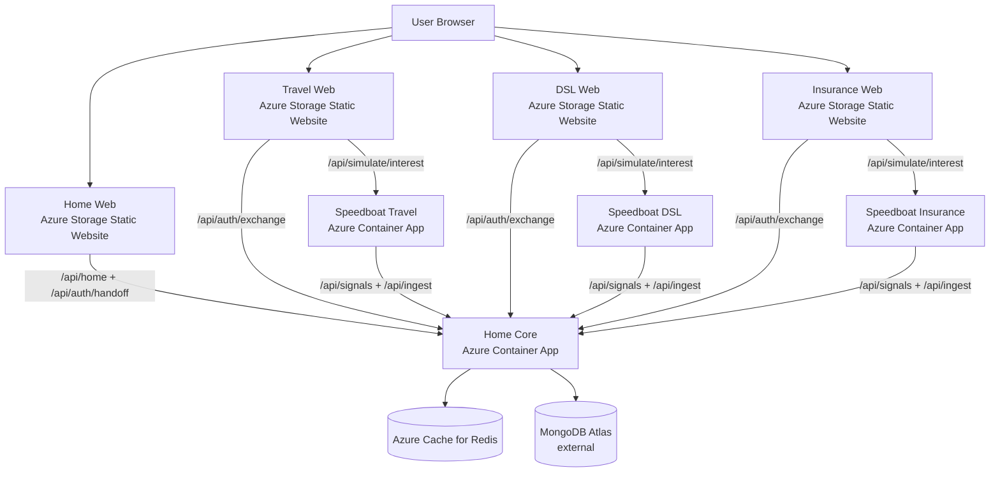

# CONCEPT

This document describes the current Proof of Concept implementation for a personalized CHECK24 Home screen that aggregates many product widgets without amplifying traffic in the Home request path.

## Goals
- **No traffic amplification**: Home read-path must not call product backends.
- **Fast reads**: One API call from clients; Home Core reads from its own store.
- **Decentralized ownership**: Product teams (“speedboats”) own their widget content and push updates independently.
- **Graceful degradation**: Missing/invalid/expired widgets should not break the Home.

## High-level architecture

**Components**
- **Home Core**: API service providing
	- `POST /api/ingest` (write path for product teams)
	- `POST /api/signals` (write path for lightweight interest signals)
	- `GET /api/home` (read path for clients)
	- `POST /api/auth/register`, `POST /api/auth/login` (JWT issuance for clients)
	- `POST /api/auth/handoff`, `POST /api/auth/exchange` (cross-origin SSO handoff for product sites)
- **Redis**: Snapshot store for widget payloads + per-user index + idempotency + rate limit counters.
- **Speedboats (product services)**: Push snapshots periodically or event-driven.
- **Clients**:
	- **Home clients**: Web (React) and Android (Compose) render the same SDUI payload.
	- **Product web sites**: separate webapps (separate origins) that talk to their speedboat and use SSO exchange to obtain a JWT.

**Key idea: push-based snapshots**
- Products push widget snapshots ahead of time.
- Home Core never calls products during `GET /api/home`.
- The Home response is computed from already-ingested snapshots.

## Data flow

### Write path (product → Home Core)
1. Product generates a widget snapshot for a user (or segment).
2. Product calls `POST /api/ingest` with headers `x-product-id` + `x-api-key`.
3. Home Core validates payload shape and enforces limits.
4. Home Core stores the snapshot in Redis with a hard TTL.
5. Home Core updates a per-user index set so the read path can resolve all widget keys efficiently.

### Signals path (product → Home Core)
1. Product emits a lightweight interest signal (e.g. user clicked an offer).
2. Product calls `POST /api/signals` with headers `x-product-id` + `x-api-key`.
3. Home Core updates per-user affinity scores in Redis.

These signals are used to bias ranking and make baseline content feel more relevant without introducing read-path coupling to product systems.

### Read path (client → Home Core)
1. Client calls `GET /api/home` with `Authorization: Bearer <JWT>`.
2. Home Core reads the per-user index set from Redis (**tight timeout / fail-fast**).
3. Home Core uses a single `MGET` to load all snapshot payloads (**tight timeout / fail-fast**).
4. Missing/expired payloads are removed from the index.
5. Response is sorted by priority and returned.

**Baseline-on-read (minimum content)**
- If a user has no pushed widgets yet, Home Core fills the response with **at least 3 baseline widgets**.
- These baseline widgets are **Home-owned** (generated at read-time), so they do not require pushing to all users.
- Personalized widgets always outrank baseline due to higher priority and/or affinity boosts.

**Read-path resilience (PoC)**
- `GET /api/home` is designed to be **always available**:
	- If Redis is unavailable, Home Core returns `200` with a degraded response.
	- Home Core keeps a small **in-memory Last Known Good (LKG)** response per user (best-effort, per instance) and serves it during short Redis outages.
	- If no LKG exists, Home Core returns a baseline-filled response (minimum 3 widgets).

This keeps the Home endpoint up during dependency outages without ever calling product backends.

## Cross-origin SSO (Home → product sites)

The PoC runs product sites as separate webapps (separate origins). Instead of shared cookies on a parent domain, we use a short-lived one-time handoff code stored in Redis.

Flow:
1. Home Web has a JWT. When a user navigates to a product site, Home Web calls `POST /api/auth/handoff` (Authorization: Bearer JWT).
2. Home Core stores `auth:handoff:{code} -> userId` in Redis for a short TTL and returns the code.
3. Home Web redirects to the product site with `?handoff=<code>`.
4. Product site calls `POST /api/auth/exchange` with `{ code }`.
5. Home Core consumes the code from Redis and returns a JWT to the product site.

Notes:
- This is best-effort: if handoff fails, navigation still works (user may need to enter an email depending on product page UX).
- Some Redis providers/versions do not support `GETDEL`. The PoC exchange endpoint falls back to `GET` + `DEL`.

## Storage model (Redis)

This PoC uses simple key patterns:
- Widget snapshot key:
	- `widget:{userId}:{productId}:{widgetId}` → JSON payload
- Per-user index key:
	- `user:{userId}:widgets` → Redis Set containing snapshot keys for that user
- Affinity scores (personalization):
	- `affinity:{userId}` → Redis Hash mapping `{ productId → score }`
- Idempotency key:
	- `idempo:{productId}:{idempotencyKey}` → `"1"` with TTL
- Rate limit counter:
	- `rl:{productId}:{windowStartEpochSeconds}` → counter (INCR) with TTL

This avoids `KEYS *` and keeps the read path bounded by the number of widgets actually referenced for the user.

## Widget payload & SDUI contract

Home Core stores an envelope with metadata plus SDUI components.

**Ingest request shape (PoC)**
```json
{
	"userId": "1",
	"widgetData": {
		"widgetId": "travel.hero.v1",
		"type": "hero_banner",
		"priority": 100,
		"schemaVersion": "1.0",
		"components": [
			{ "type": "HeroBanner", "props": { "title": "Mallorca Deal" } },
			{ "type": "TextCard", "props": { "title": "Why?", "text": "..." } }
		],
		"data": {}
	}
}
```

**SDUI principles in this PoC**
- `components[]` is a list of UI blocks.
- Each component has a `type` and a `props` object.
- Clients render only known component types; unknown types can be ignored (graceful degradation).

The concrete renderers live in:
- Web: `frontend-web/src/components/WidgetRenderer.tsx`
- Android: `frontend-mobile/android/app/src/main/java/.../MainActivity.kt`

### Images in widgets (PoC)

Some components support optional images:
- `HeroBanner.props.imageUrl`
- `TextCard.props.imageUrl`

To keep the PoC robust in locked-down environments (ad blockers / DNS / proxies), mock images are generated as inline SVG `data:` URLs where possible.

## Product offers → click tracking → personalized hint

Each product site displays 5 mock offers. Clicking an offer does two things:
1. Sends an "interest" event to the product speedboat (e.g. `POST /api/simulate/interest` with `{ email, offerId }`).
2. Navigates to `/offer/{offerId}` within the product webapp.

Each speedboat aggregates clicks per user and per offer and pushes a product/offer-specific "Personalized hint" `TextCard` to Home Core. This demonstrates decentralized personalization where product teams fully own their content.

## TTL semantics

This PoC encodes two times:
- **Hard TTL (enforced)**: Snapshot is stored in Redis with `WIDGET_HARD_TTL_SECONDS` and will be deleted automatically.
- **Soft TTL (informational)**: Envelope includes `softExpiresAt` (currently not enforced server-side; intended for future “staleness” UI rules).

Net effect:
- If a product stops pushing, its widgets naturally disappear after the hard TTL.

## Safety controls (PoC)

### Payload size limits
- Home Core enforces a maximum ingest payload size (default 64 KB) via Fastify `bodyLimit`.
- Additionally, if the request has a `Content-Length` header larger than the limit, it fails fast with `413`.

### Per-product rate limiting
- Ingest is rate-limited per `productId` using Redis counters (default 120/min).
- On limit exceed, Home Core responds with `429` and sets the `retry-after` header.

### Idempotency
- Products can send `idempotency-key` to make retries safe.
- Duplicates return `{ "status": "duplicate" }` without writing a new snapshot.

## Failure modes & behavior
- **Product down**: No impact to read path. Widgets slowly expire.
- **Redis down**:
	- `POST /api/ingest` returns `500 Storage Failure`
	- `POST /api/signals` returns `500 Signal Failure`
	- `GET /api/home` returns `200` and degrades gracefully:
		- Prefer in-memory LKG (`meta.degraded=true`, `meta.source=lkg`)
		- Otherwise baseline widgets (`meta.degraded=true`, `meta.source=empty`)
- **Bad payload**: Ingest returns `400` (schema validation).
- **Expired/missing widget keys**: Removed from the per-user index automatically during reads.

## Scaling notes

This PoC is intentionally simple, but the pattern scales:
- Home Core is **stateless** (aside from Redis), so it can scale horizontally.
- Read path is efficient: `SMEMBERS` + `MGET` + in-memory sort.
- For production, consider:
	- Managed Redis (replication, persistence, backups)
	- Durable storage for long-lived personalization (e.g., database) + Redis as cache
	- Asynchronous ingest via a queue (for smoothing spikes)
	- Stronger authN/authZ (mTLS/OAuth, key rotation), auditing and per-tenant controls

## Azure deployment architecture (IaC)

The repo includes an Azure deployment using:
- Azure Container Apps: `home-core` + 3 speedboats
- Azure Cache for Redis
- Azure Container Registry (build via `az acr build`)
- Azure Storage Static Website hosting: Home Web + 3 product webapps

Mermaid overview:



## Configuration (Home Core)

Home Core reads configuration from environment variables:
- `REDIS_URL` (default: `redis://localhost:6379`)
- `MONGODB_URI` (required for PoC `/api/auth/*` endpoints)
- `JWT_SECRET` (required)
- `INGEST_KEY_TRAVEL` (default: `dev-secret-123`)
- `MAX_INGEST_PAYLOAD_BYTES` (default: `65536`)
- `INGEST_RATE_LIMIT_PER_MINUTE` (default: `120`)
- `WIDGET_SOFT_TTL_SECONDS` (default: `60`)
- `WIDGET_HARD_TTL_SECONDS` (default: `3600`)
- `INDEX_TTL_SECONDS` (default: `604800`)
- `IDEMPOTENCY_TTL_SECONDS` (default: `300`)
- `MIN_WIDGETS` (default: `3`) – minimum widgets returned on reads

Read-path resilience (PoC):
- `REDIS_READ_TIMEOUT_MS` (default: `40`) – per Redis read operation timeout budget
- `LKG_TTL_MS` (default: `300000`) – in-memory Last Known Good TTL
- `LKG_MAX_ENTRIES` (default: `5000`) – max LKG entries kept in memory

## Local run

The fastest path is Docker Compose:
- `docker compose -f infra/docker-compose.yml up --build`

This starts:
- Redis on `localhost:6379`
- Home Core on `localhost:3000`
- `speedboat-travel` pushing snapshots periodically

